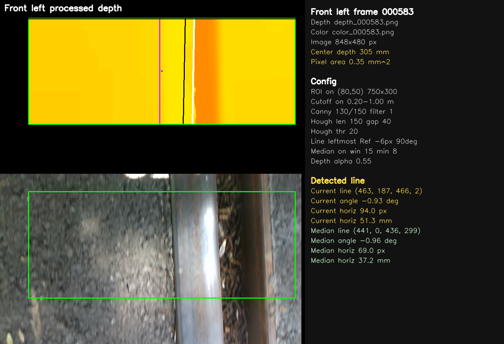

# Recording Analyzer

Tiny standalone version of the four-camera notebook viewer.

## Setup

From this folder:

```bash
python -m venv .venv
source .venv/bin/activate
pip install -r requirements.txt
```

On Windows, activate the venv like this instead:

```bash
.venv\Scripts\activate
```

## Four-camera viewer

```bash
python analyze_recordings.py /path/to/recording_root
```

The recording folder should contain the four camera folders:

```text
depth_front_left/
depth_front_right/
depth_rear_left/
depth_rear_right/
```

Each camera folder needs a `color/` folder with `color_*.png` files and a `depth/` folder with `depth_*.png` files.

The viewer opens a separate **Depth camera navigation** window. It previews
the `DepthCameraNavigation` content for the selected recording time by combining
the median deviations from the two front cameras and the two rear cameras. The
same confidence, timestamp-difference, angle-difference, and
horizontal-difference thresholds as the ROS2 implementation are applied. The
age check accepts the nearest recorded frame on either side of the selected
time. The panel shows the configured 10 Hz / 100 ms output cycle; the offline
preview itself is refreshed whenever the selected frame changes.

### Controls

- Left/Right or A/D: move one frame
- Up/Down or W/S: move ten frames
- type a number + Enter: jump to a master frame
- Home/End: first/last frame
- Q/Esc: close

## Folder processing script

Use `process_depth_images.py` to process paired color/depth PNGs from one camera
and save the processed visualizations as images.

Example for front left:
```bash
python process_depth_images.py \
  --config front_left_depth_processing.yaml \
  --input-dir /path/to/depth_front_left \
  --output-dir /path/to/processed_output
```

The input folder should contain `color/` and `depth/` subfolders with matching
PNG names such as `color_000001.png` and `depth_000001.png`.

The output folder is created if needed. For each input image, the script writes a
processed PNG with the same name plus `_processed`: `depth_000001_processed.png`.


The saved image contains the processed depth visualization, color image,
reference line, current and median detected lines, center point, and a metadata
panel on the right. The per-camera `*_depth_processing.yaml` files contain the
camera, ROI, reference-line, median-line, and edge-detection settings used by
the processing pipeline.



